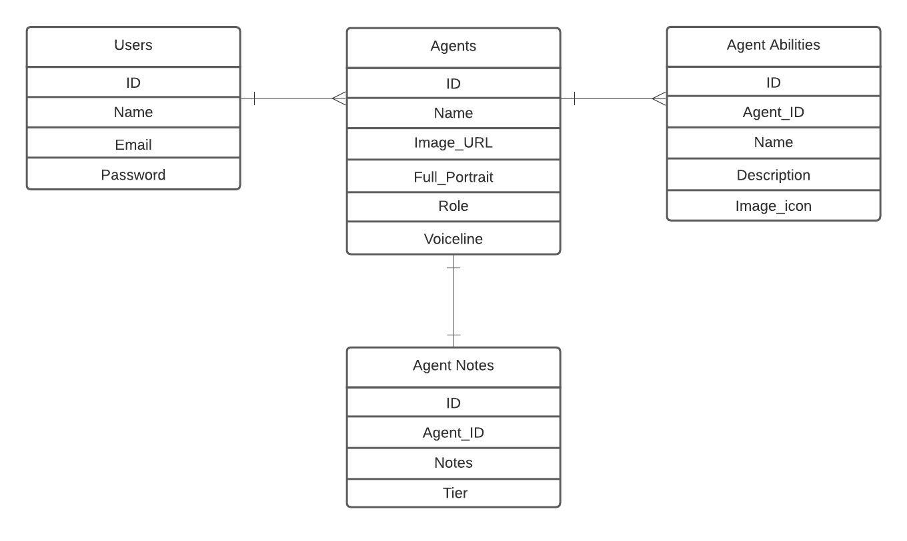

# Project #2: Valorant Select

## Project Idea - Base plan
The homepage should show the user a button to sign up and a button to login. It should also display the agent roster for Valorant where the user will be able to click the agent icons which shows the information on that character. The user should also be able to search for an agent from an API. Below the icon, it will have a button that sends the agent information to the users account so that it may be viewed on another page.

If the user is not logged in and clicks on the button to send that agent's information to a user account, it will load another page that prompts the user to log in or sign up.

Homepage should also have a nice lobby music that continues to play thoughout navigation of the app. There should also be an option to turn the audio off and on.

To access each agent's unique abilities, iterate through agents_abilities table using .each method and add if statement, so that agents abilities will only be displayed if agent_id from agent_abilities = id from agents table.

## Project After Review
After reviewing the features that I had wanted to implement in the early stages, I came to a conclusion that some of those features would not be applicable as it would not function properly while trying to utilise what I have learnt from my classes. 

## CRUD app function
The main function for my CRUD app lies on the more simple side of the spectrum. The user would select an agent that is displayed and is prompted to write a note if it does not already exist. The inspiration came from e-sports as there is a huge amount of planning in terms of what utilities/characters are best for that specific game and I thought it would be very efficient if there was a website so that teams could write notes. 

## Biggest Struggle
During this project, I had so many ideas going through my head that it was very hard for me to figure out a project that I would be able to complete within my skillsets before the deadline. The ideas would have me sitting at my computer for more than an hour, thinking of how to add one feature to the next. These ideas would also keep popping up whilst I was working on my project so it was one of my main struggles that I experienced. 

I also had a hard time managing the data that came from the external API for my project theme. There was so much data to handle and being able to find methods to grab specific data was very time consuming and stressful. It didn't help that the data would be nested in hashes within hashes.

<a href="https://valorant-api.com/v1/agents">API I used for this project</a>

## Unsolved Issues
From my perspective, I don't believe that there are any issues but this project is not 100% complete. I believe that my struggle of having too many ideas resulted in this outcome as the feature I wanted to implement (listing out the abilities for each agent) is not yet implemented into this project. Linking the data from the API to the database used in the project took so much of my time that I was not able to display the information into my app. If I had done so, I believe I would have gone over the allocated time period to complete this project. 

## Cool Tech
Similar to my Tic Tac Toe project, I again utilised bootstrap as my main feature for displaying information. Instead of the carousel bootstrap, I have used the collapse function of bootstrap since I thought it was very fitting for the kind of information I wanted to display. It came out very nicely after tweaking the CSS to my liking.

## Diagrams

## Project Link
Feel free to go through my CRUD app and see the end result :)

You can access my CRUD app here:
<a href="https://whispering-hollows-57896.herokuapp.com/">Click here</a>